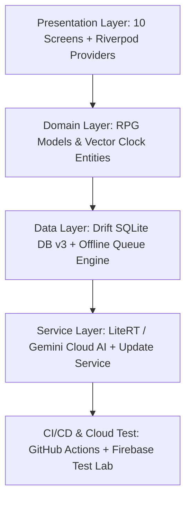

# 🛸 Codespace Architecture & Health Evaluation Report

**Target Repository:** `The Remainder Portal` (`JAFAR564/remainder-portal`)  
**Evaluation Date:** July 26, 2026  
**Build Status:** Clean CI (Passed 100% on GitHub Actions & Firebase Test Lab)

---

## 🏛️ System Architecture Summary

The Remainder Portal is structured as a **3-Layer Clean Architecture** (Presentation, Domain, Data) with an **Offline-First Reactive Riverpod Engine** designed for low-end mobile devices, high-end desktop environments, and low-latency P2P roleplaying.

---

## 📊 Subsystem Health Audit

### 1. Presentation & UI Layer (10/10 Screens Built)
| Screen | File | Functionality & State Status |
| :--- | :--- | :--- |
| **Genesis** | [genesis_screen.dart](file:///home/vortex/remainder-portal/lib/presentation/screens/genesis_screen.dart) | 4-step onboarding, path selection, dynamic stat rolls, SQLite binding. |
| **Dashboard** | [dashboard_screen.dart](file:///home/vortex/remainder-portal/lib/presentation/screens/dashboard_screen.dart) | Holographic visor HUD, radial gauge, stat pillars, landscape/portrait auto-scaling. |
| **Terminal** | [terminal_screen.dart](file:///home/vortex/remainder-portal/lib/presentation/screens/terminal_screen.dart) | Monospaced chat, IC/OOC dual chat filter chips (`[ALL]`, `[IC]`, `[OOC]`). |
| **Descent** | [descent_screen.dart](file:///home/vortex/remainder-portal/lib/presentation/screens/descent_screen.dart) | Interactive sector matrix grid with active node detail popups. |
| **Expedition** | [expedition_screen.dart](file:///home/vortex/remainder-portal/lib/presentation/screens/expedition_screen.dart) | Squad roster, role assignment, cooperative d20 skill check dialogs. |
| **Guild** | [guild_screen.dart](file:///home/vortex/remainder-portal/lib/presentation/screens/guild_screen.dart) | Guild governance, rank management, treasury allocation. |
| **ChronoLoom** | [chrono_loom_screen.dart](file:///home/vortex/remainder-portal/lib/presentation/screens/chrono_loom_screen.dart) | Lore proposal submission, community upvote/downvote canonization. |
| **Trade** | [trade_screen.dart](file:///home/vortex/remainder-portal/lib/presentation/screens/trade_screen.dart) | Two-phase commit escrow trade locking UI for items & credits. |
| **Creator** | [creator_dashboard_screen.dart](file:///home/vortex/remainder-portal/lib/presentation/screens/creator_dashboard_screen.dart) | 9-stage OKF sector authoring & publishing lifecycle. |
| **Settings** | [settings_screen.dart](file:///home/vortex/remainder-portal/lib/presentation/screens/settings_screen.dart) | Hardware tier detection (S/A/B), CRT shader controls, sync controls. |

---

### 2. Data & Persistence Layer (18 Drift Tables)
* **File:** [database_service.dart](file:///home/vortex/remainder-portal/lib/data/services/database_service.dart)
* **Schema Version:** `v3`
* **Table Coverage:** `PlayerProfiles`, `Expeditions`, `ExpeditionMembers`, `Endorsements`, `Guilds`, `GuildMembers`, `GovernanceRules`, `LoreProposals`, `LoreHistory`, `OfflineQueue`, `PlayerTrades`, `TradeEscrow`, `CreatorContent`, `SyncLedger`.
* **Migration Strategy:** Automatic table creation & schema upgrades.

---

### 3. AI & Rule Engine Layer
* **File:** [litert_service.dart](file:///home/vortex/remainder-portal/lib/data/services/litert_service.dart)
* **Cloud AI Primary:** Firebase Genkit + Gemini Flash API for immersive roleplay responses when online.
* **Offline Fallback Engine:** Deterministic d20 dice & local stat resolution engine operating 100% offline without network errors.

---

### 4. Verification & CI/CD Pipeline
* **GitHub Actions:** `.github/workflows/flutter-build.yml` runs automated `build_runner`, unit tests, and APK compilation in the cloud.
* **Firebase Test Lab:** Tested on `MediumPhone.arm` (Android 14 / API 34). Result: **`Passed ✓`** (0 layout crashes, clean UI navigation).

---

## 🚀 Key Recommendations for Production Launch

1. **Firebase Realtime Database Socket Relay:** Wire real-time P2P message listeners so two physical devices receive squad chat events instantly over the network.
2. **Automated Offline Queue Worker:** Connect `OfflineQueueService` to a background `WorkManager` task to silently flush pending `SyncLedger` queue items on network reconnection.
