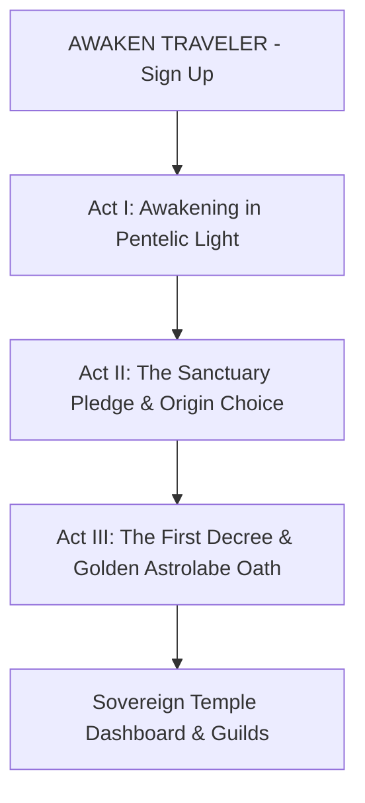

# 📖 Genesis Story Mode & Interactive Prologue Blueprint

## 📌 Concept & Vision
When a traveler signs up for the first time (`AWAKEN TRAVELER`), they enter **Chapter 0: Genesis Prologue** before unlocking the main Sovereign Temple Dashboard.

The Story Mode serves as both a **cinematic narrative awakening** and an **interactive tutorial** where the World Arbiter (Cardinal) guides the player through their first choices, introduces the conlang (*Ethereal Scribe*), and grants their starting spirit essence.

---

## 🎬 Story Mode Structure & Act Script

### 📜 Act I: The Awakening in Pentelic Light
* **Narrative:** The traveler awakens falling through soft, glowing parchment. Golden cursive runes dissolve like stardust into petrichor.
* **World Arbiter Dialogue:** *"Fragment of the waking world: you have slipped through the seams of your previous existence. Tell me... what is the last memory you carry before your soul took flesh in the Sovereign Realm?"*
* **Interactive Choices:**
  1. *I remember a world of noise and glass.*
  2. *I remember a battle under a dying sun.*
  3. *I remember nothing but a yearning for freedom.*

### 🏛️ Act II: The Sanctuary Pledge
* **Narrative:** The parchment settles into polished Pentelic White Marble. Three ancient pillars of light rise toward an infinite golden sky—the Aether-Wake, the Amatsukrion Grid, and the Wyrd-Loom.
* **World Arbiter Dialogue:** *"The World Arbiter (Cardinal) has verified your spirit cores. You stand within Sanctuary 4. As a Traveler, your prose and actions will shape the fate of all registered guilds."*
* **Interactive Choices:**
  1. *I pledge my Aether to protect the innocent.*
  2. *I seek to master the laws of reality.*
  3. *I march to conquer dungeons and claim glory.*

### 🌟 Act III: The First Decree
* **Narrative:** A radiant Golden Astrolabe emblem descends from the sky, hovering before your chest. The World Arbiter inscribes your traveler title upon the eternal loom.
* **World Arbiter Dialogue:** *"Your oath is recorded in the Chrono-Loom. Step through the archway, Traveler. The Sovereign Realm awaits your command."*
* **Action:** `STEP THROUGH THE ARCHWAY INTO THE REALM` $\rightarrow$ Unlocks Dashboard & increases Spirit Essence.

---

## 📊 Google Slides Presentation Script Map (For External Pitch / Community)

If you present this Story Mode to your community or team via Google Slides, here is the 5-slide presentation deck layout:

| Slide # | Slide Title | Visual Content | Audio / Speaker Notes |
| :---: | :--- | :--- | :--- |
| **Slide 1** | **The Remainder Portal: Genesis Story Mode** | White Marble backdrop, Golden Astrolabe emblem, serif title typography. | *"Welcome to the Sovereign Realm—where every player's written word shapes reality."* |
| **Slide 2** | **Act I: The Awakening** | Soft parchment background with glowing golden cursive runes dissolving into rain. | *"The traveler awakens from the Void into Sanctuary 4."* |
| **Slide 3** | **Act II: The World Arbiter's Pledge** | Pentelic White Marble pillars with gold leaf borders and blue Aether streams. | *"The AI System Arbiter (Cardinal) adjudicates d20 rolls and grants traveler titles."* |
| **Slide 4** | **Act III: Conlang & Ethereal Scribe** | Ethereal Scribe Lexicon terms (*Amatsukrion*, *Wyrd-Kaze*, *Aetheromaru*). | *"Introducing Ethereal Scribe—the conlang that dictates spatial physics and spellcasting."* |
| **Slide 5** | **Act IV: The Sovereign Community** | Screenshot carousel of Dashboard, Guilds, Squads, and Nexus Roleplay Wall. | *"Step through the archway into a sovereign fantasy community."* |
