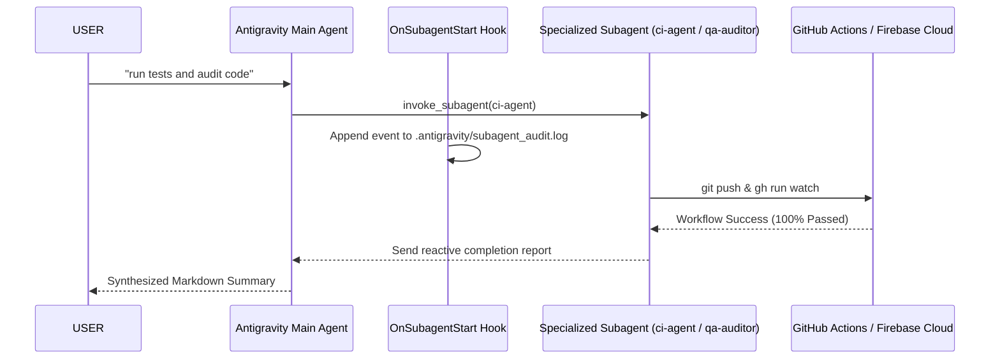

# 🤖 Antigravity Subagent Swarm Architecture Guide

## 📌 Executive Summary

Subagents in Google Antigravity CLI (`agy` / Antigravity 2.0) allow the main agent to offload parallel, context-heavy tasks to background conversations without cluttering the main turn history. Combined with our **3-Tier Memory Hooks** (`Mem0` + `Napkin` + `Graphify`), subagents boot with full architectural awareness and log their lifecycle events into `.antigravity/subagent_audit.log`.

---

## 🛠️ Defined Specialized Subagents

| Subagent Name | Role | Responsibilities | Tool Permissions |
| :--- | :--- | :--- | :--- |
| **`research`** | **Codebase & Docs Researcher** | Read-only exploration of large source files, pub.dev packages, and documentation without cluttering main context. | Read tools, MCP |
| **`ci-agent`** | **Cloud & Release Operator** | Handles git pushes, monitors GitHub Actions runs (`gh run watch`), downloads build artifacts, and triggers Firebase Test Lab matrix executions. | Write tools, CLI, MCP |
| **`qa-auditor`** | **QA & System Integrity Auditor** | Verifies PRD compliance, audits database migrations, updates `HANDOVER.md` and `.antigravity/napkin.md`. | Write tools, CLI, MCP |
| **`self`** | **Full Capability Clone** | Inherits full parent agent configuration for isolated, multi-step sub-task execution. | Inherits parent |

---

## 🔄 Subagent Swarm Interaction Flow

---

## 💡 Subagent Best Practices in Antigravity

1. **No Polling Required:** The system automatically notifies the main agent when a subagent finishes or emits output.
2. **Context Isolation:** Keeps turn history light by delegating 500-line file inspections or long build logs to background subagent conversations.
3. **Workspace Modes:**
   - `inherit` (default): Shares current working directory.
   - `share` / `branch`: Creates isolated worktree branches for experimental code changes.
