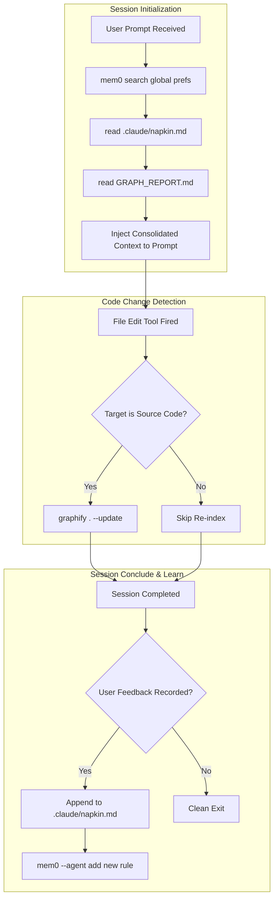

# 🧠 3-Tier Automated Agent Memory Architecture (Mem0 + Napkin + Graphify)

## 📌 Executive Architectural Summary

This design establishes a fully automated, self-updating memory and context loop for AI coding agents (`Antigravity CLI`, `AGY 2.0`, `Claude Code`, `OpenCode`). By leveraging **CLI Agent Hooks** (`PreInvocation`, `PostToolUse`, `PostInvocation`), the agent maintains seamless state continuity without requiring manual prompt engineering or memory re-indexing.

---

## 🏗️ The 3-Tier Memory Taxonomy

| Tool | Scope | Purpose | Storage Target |
| :--- | :--- | :--- | :--- |
| **`Mem0`** | **Global** | Long-term developer preferences, global CLI offloading rules, and cross-project habits. | `~/.gemini/antigravity-cli/mem0.json` / `mem0` CLI |
| **`Napkin`** | **Repository** | Session-bound scratchpad tracking active tasks, user feedback, and repo-specific rules. | `.claude/napkin.md` or `scratch/napkin.md` |
| **`Graphify`** | **Codebase** | Structural AST dependency graph, god node detection, call hierarchies, and file imports. | `lib/graphify-out/graph.json` |

---

## 🔄 Automated Lifecycle Hook Pipeline



---

## ⚙️ Hook Implementation Scripts

### 1. PreInvocation (`.agents/hooks/pre_invocation.sh`)
```bash
#!/usr/bin/env bash
# Injects global preferences, repository napkin notes, and graphify status into agent context

MEM0_PREFS=$(mem0 --agent search "user preferences and coding style" --user-id default 2>/dev/null)

if [ ! -f ".claude/napkin.md" ]; then
  mkdir -p .claude
  cat << 'EOF' > .claude/napkin.md
# Napkin Notes
## Active Execution Context
## User Feedback & Corrections
## Repo Architectural Directives
EOF
fi

cat << EOF
{
  "hook_type": "context_injection",
  "mem0_memory": ${MEM0_PREFS:-"{}"},
  "napkin_notes": $(jq -aRs . < .claude/napkin.md),
  "graphify_available": $([ -f "lib/graphify-out/GRAPH_REPORT.md" ] && echo "true" || echo "false")
}
EOF
exit 0
```

### 2. PostToolUse (`.agents/hooks/post_tool_use.sh`)
```bash
#!/usr/bin/env bash
# Triggers fast incremental AST re-parse when source code files are modified

INPUT=$(cat)
TOOL_NAME=$(echo "$INPUT" | jq -r '.tool_name // empty')

if [[ "$TOOL_NAME" =~ (write_to_file|replace_file_content|multi_replace_file_content) ]]; then
  graphify . --update > /dev/null 2>&1
fi

exit 0
```

### 3. PostInvocation (`.agents/hooks/post_invocation.sh`)
```bash
#!/usr/bin/env bash
# Saves user corrections and new learned behavior rules across projects

INPUT=$(cat)
USER_CORRECTION=$(echo "$INPUT" | jq -r '.user_feedback // empty')

if [ -n "$USER_CORRECTION" ]; then
  DATE=$(date +%Y-%m-%d)
  echo "| $DATE | User Feedback | $USER_CORRECTION | Applied |" >> .claude/napkin.md
  mem0 --agent add "User prefers: $USER_CORRECTION" --user-id default > /dev/null 2>&1
fi

exit 0
```

---

## 🎯 Key Architectural Benefits

1. **Zero Context Loss Between Sessions:** Eliminates cold start friction when opening a new chat or resetting context after 25 turns.
2. **Self-Healing AST Graphs:** `Graphify` stays in sync with code edits incrementally without full repo rescans.
3. **Cross-Project Intelligence:** `Mem0` ensures rules established in one repository (e.g. cloud command offloading, HSL color palettes) apply globally across all workspaces.
