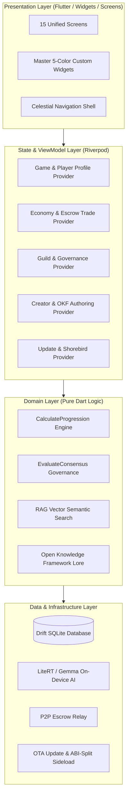

# 🏛️ Remainder Portal Architecture & System Design

**Repository:** `The Remainder Portal` (`https://github.com/JAFAR564/remainder-portal`)  
**Current Version:** `1.1.2+6` (Master 5-Color Unified Architecture)  
**Target Environment:** Honor X8 (Android / Termux + Antigravity CLI)  
**Last Updated:** August 26, 2026  

---

## 1. 📐 High-Level Architecture Overview

The Remainder Portal is built on a clean, decoupled 3-tier reactive architecture with Riverpod state management and Drift offline persistence:

---

## 2. 🛡️ Architectural Guardrails & Rules

1. **Unidirectional Dependency:**
   - `Presentation` depends on `State` (Riverpod).
   - `State` depends on `Domain` and `Data`.
   - `Domain` is **100% pure Dart** (no Flutter UI bindings).
   - **Never** write raw SQL or database queries inside UI widgets.

2. **Master 5-Color Visual Design Tokens:**
   - `0xFF291C0E` (Deep Espresso) $\rightarrow$ Typography, dark accents, primary borders.
   - `0xFF6E473B` (Warm Terracotta) $\rightarrow$ CTAs, active highlights, key accents.
   - `0xFFA78D78` (Almond Taupe) $\rightarrow$ Container outlines, card borders.
   - `0xFFBEB5A9` (Cashmere Stone) $\rightarrow$ Secondary text, metadata, inactive bars.
   - `0xFFE1D4C2` (Frosted Cream Sand) $\rightarrow$ Scaffold backgrounds, elevated cards.

3. **Cloud CI / Offloaded Compilation:**
   - All Flutter builds, widget tests, and code generation (`build_runner`) run in GitHub Actions.
   - Fast ARM64 APKs (~18MB) are automatically deployed to GitHub Releases.

4. **Modular File Scoping:**
   - Split files when responsibilities become hard to isolate, test, or modify safely.
   - Favor cohesive modules and clear interface boundaries over arbitrary line count splits.
