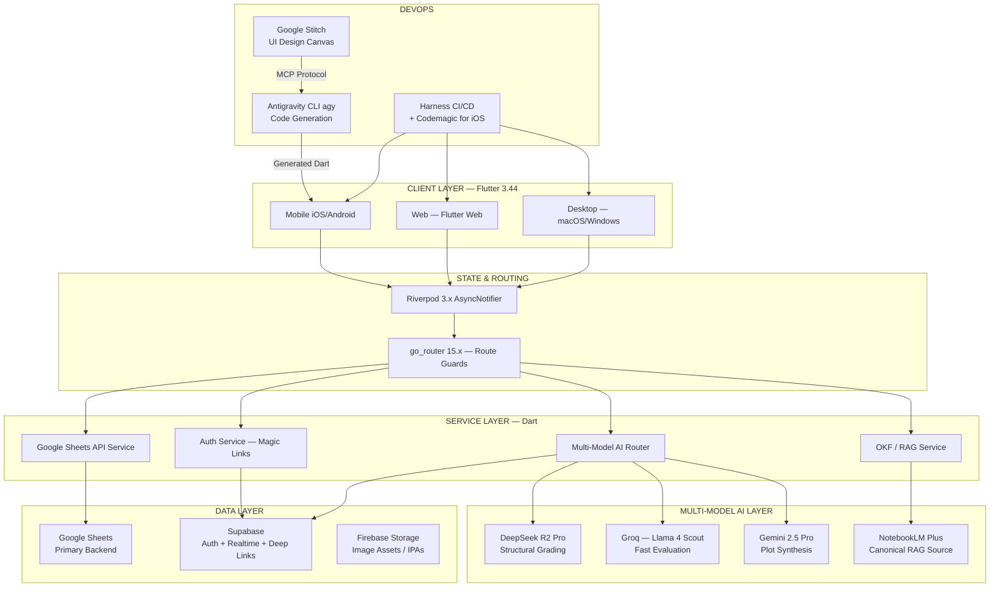

# Module 2: Technical Requirement Document (TRD)

## 2.1 — System Architecture Overview



---

## 2.2 — Project Structure

```
remainder_portal/
├── AGENTS.md                        # agy instruction file — coding rules, arch patterns
├── DESIGN.md                        # Stitch design system export — agent-readable
├── .agents/
│   └── skills/
│       ├── glass_card_skill.md      # Skill: generate glassmorphic widgets
│       ├── sheets_service_skill.md  # Skill: generate Sheets API calls
│       └── ai_router_skill.md       # Skill: generate AI routing logic
├── lib/
│   ├── main.dart
│   ├── theme/
│   │   └── portal_theme.dart
│   ├── router/
│   │   └── app_router.dart          # go_router config + route guards
│   ├── features/
│   │   ├── auth/                    # Magic link auth
│   │   ├── roster/                  # Community Roster feature
│   │   ├── admittance/              # Admin pipeline feature
│   │   ├── chronicles/              # World state / timeline feature
│   │   └── profile/                 # Character profile management
│   ├── services/
│   │   ├── sheets_service.dart      # Google Sheets read/write
│   │   ├── ai_router_service.dart   # Multi-model routing
│   │   ├── okf_service.dart         # OKF / RAG query interface
│   │   └── auth_service.dart        # Magic link + Supabase auth
│   ├── models/                      # Dart data classes (freezed)
│   └── ui/
│       ├── components/              # Shared: GlassCard, SpringTap, etc.
│       ├── layouts/                 # Responsive layout builders
│       └── animations/              # Custom springs, shimmer, glows
├── test/
│   ├── unit/
│   ├── widget/
│   └── integration/
├── harness/                         # Harness pipeline YAML definitions
└── pubspec.yaml
```
