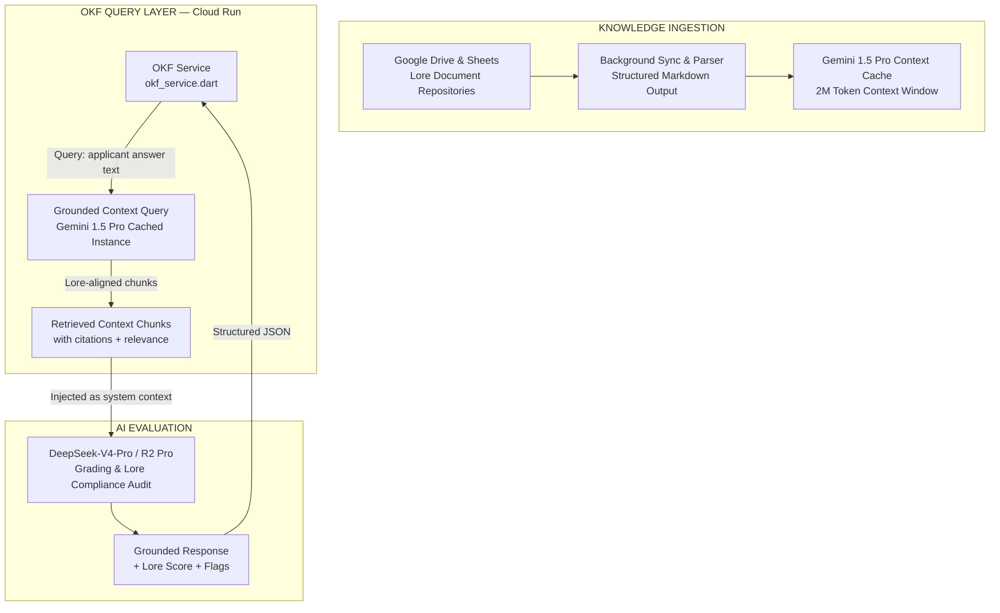

# TRD §2.3 — Data & Knowledge Layer

> **Part of:** Module 2: Technical Requirement Document
> **Navigation:** Up from `01_system_architecture.md` | Next to `03_multi_model_ai.md`

---

## 2.3.1 — Google Sheets Integration

The Google Sheets backend is structured across four named tabs:

| Tab Name | Purpose | Key Columns |
|---|---|---|
| `Roster` | All approved members | `id`, `character_name`, `player_name`, `faction`, `faceclaim_name`, `faceclaim_img_url`, `status`, `joined_date` |
| `Faceclaims` | Faceclaim reservation registry | `faceclaim_name`, `reserved_by`, `approved`, `image_url` |
| `Admittance_Log` | Application records + outcomes | `app_id`, `submitted_at`, `applicant_email`, `status`, `deepseek_score`, `groq_flags`, `admin_decision`, `decided_at` |
| `Applications` | Raw answer sheets | `app_id`, `q1_answer` ... `q12_answer` |

### Sheets Service (Dart)

```dart
// lib/services/sheets_service.dart
import 'package:googleapis/sheets/v4.dart';
import 'package:googleapis_auth/auth_io.dart';

class SheetsService {
  static const _spreadsheetId = 'YOUR_SPREADSHEET_ID';
  late final SheetsApi _sheetsApi;

  Future<void> init(ServiceAccountCredentials credentials) async {
    final client = await clientViaServiceAccount(
      credentials,
      [SheetsApi.spreadsheetsScope],
    );
    _sheetsApi = SheetsApi(client);
  }

  Future<List<Character>> fetchRoster() async {
    final response = await _sheetsApi.spreadsheets.values.get(
      _spreadsheetId,
      'Roster!A2:I1000',
    );
    return response.values
        ?.map((row) => Character.fromSheetRow(row))
        .toList() ?? [];
  }

  Future<void> writeAdmittanceDecision({
    required String appId,
    required String decision,
    required double deepseekScore,
    required List<String> groqFlags,
  }) async {
    final range = await _findRowByAppId(appId);
    await _sheetsApi.spreadsheets.values.update(
      ValueRange(values: [[decision, deepseekScore, groqFlags.join(','), DateTime.now().toIso8601String()]]),
      _spreadsheetId,
      range,
      valueInputOption: 'USER_ENTERED',
    );
  }
  // ... _findRowByAppId, checkFaceclaimAvailability, etc.
}
```

**Security Note:** The `ServiceAccountCredentials` JSON must **never** be bundled in the Flutter app binary. It is called exclusively from a server-side Cloud Run function. The Flutter client communicates with that function over HTTPS using a short-lived Firebase ID token for authorization.

---

## 2.3.2 — Open Knowledge Framework (OKF) Architecture

The OKF is the canonical lore brain of the application. It ensures all AI models operate on verified world-state rather than hallucinated inference. To bypass the Enterprise NotebookLM API restrictions on programmatic vector querying, a custom long-context ingestion pipeline is built using Gemini 1.5 Pro's 2M token window with context caching.



### OKF Service (Dart Interface to Cloud Run)

```dart
// lib/services/okf_service.dart
class OKFService {
  final Dio _dio;
  static const _cloudRunBase = 'https://okf-service-xxx-uc.a.run.app';

  /// Queries the programmatic Gemini 1.5 Pro context caching instance
  /// to fetch lore-grounded context chunks and citations.
  Future<OKFQueryResult> queryLoreContext({
    required String answerText,
    required String queryIntent,
    int topK = 5,
  }) async {
    final response = await _dio.post(
      '$_cloudRunBase/okf/query',
      data: {
        'query': answerText,
        'intent': queryIntent,
        'top_k': topK,
        'require_citations': true,
      },
    );
    return OKFQueryResult.fromJson(response.data);
  }
}

@freezed
class OKFQueryResult with _$OKFQueryResult {
  const factory OKFQueryResult({
    required List<LoreChunk> chunks,
    required double relevanceScore,
    required List<String> citationSources,
  }) = _OKFQueryResult;
}
```

### Anti-Hallucination & Reasoning Protocol

DeepSeek-V4-Pro is constrained via a structured system prompt that enforces:

1. **`LORE CONTEXT BLOCK`**: Injected retrieved chunks from the Gemini 1.5 Pro cache are wrapped in `<lore_context>` XML tags.
2. **`GROUNDING DIRECTIVE`**: "You must only evaluate based on content within `<lore_context>`. If a claim cannot be substantiated by the provided context, flag it as `UNVERIFIED` — do not infer."
3. **`OUTPUT SCHEMA`**: Response must conform to `ApplicationGradeResult` JSON schema (validated server-side with Dart `json_schema` package before returning to client).
