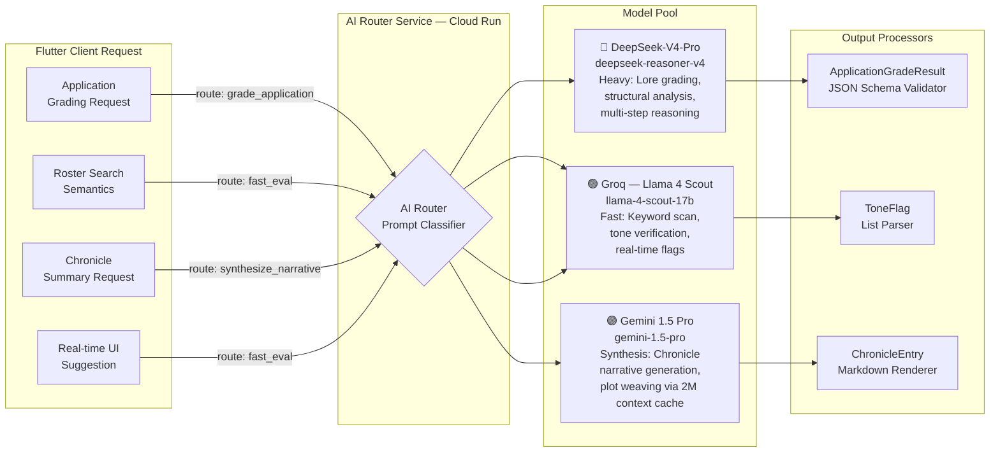

# TRD §2.4 — Multi-Model AI Service Layer

> **Part of:** Module 2: Technical Requirement Document
> **Navigation:** Up from `02_data_knowledge_layer.md` | Next to `04_vibe_coding_pipeline.md`

---

## 2.4.1 — Model Routing Architecture



### AI Router Service (Dart + Genkit Dart)

Genkit Dart is an open-source, model-agnostic framework for building AI-powered applications in Dart and Flutter. It provides a structured way to integrate AI features into your app with support for multiple model providers, including Google Gemini, Anthropic Claude, and OpenAI. This makes it the ideal orchestration backbone for the multi-model routing layer.

```dart
// server/ai_router/lib/router.dart  (deployed as Cloud Run — Dart runtime)
import 'package:genkit/genkit.dart';

final gradeApplicationFlow = defineFlow(
  name: 'gradeApplication',
  inputSchema: applicationInputSchema,
  outputSchema: gradeResultSchema,
  fn: (ApplicationInput input) async {
    // Step 1: Retrieve lore context from OKF (queries programmatic Gemini 1.5 Pro context cache)
    final loreContext = await okfService.queryLoreContext(
      answerText: input.combinedAnswers,
      queryIntent: 'character_lore_and_faction_compliance',
    );

    // Step 2: DeepSeek-V4-Pro structural + lore evaluation grounded in cached context
    final deepseekResult = await generate(
      model: 'deepseek/deepseek-reasoner-v4',
      prompt: buildDeepSeekGradingPrompt(input, loreContext),
      config: GenerationConfig(temperature: 0.1, maxTokens: 2048),
    );

    // Step 3: Groq fast tone/keyword scan (parallel)
    final groqResult = await generate(
      model: 'groq/llama-4-scout-17b-16e-instruct',
      prompt: buildGroqTonePrompt(input.combinedAnswers),
      config: GenerationConfig(temperature: 0.0, maxTokens: 512),
    );

    // Step 4: Merge and validate against JSON schema
    return mergeGradeResults(deepseekResult, groqResult, loreContext);
  },
);
```

The Genkit model-agnostic API allows switching between AI providers with minimal code changes. Type-safe schemas define strongly-typed inputs and outputs for AI interactions using the `schemantic` package. Flows are testable, observable, and deployable functions that wrap AI logic with typed inputs and outputs. Tools define functions that models can invoke to fetch live data or perform actions.

---

## 2.4.2 — Model Responsibility Matrix

| Task | Primary Model | Why | Latency Budget |
|---|---|---|---|
| Application structural grading | DeepSeek-V4-Pro / R2 Pro | Multi-step reasoning, lore compliance chains | < 8s |
| Keyword/tone flags | Groq Llama 4 Scout | Ultra-low latency inference | < 400ms |
| Chronicle narrative generation | Gemini 1.5 Pro | Long-context (2M tokens), context cached synthesis | < 6s |
| Faceclaim image labeling | Gemini 1.5 Flash | Vision + speed | < 1s |
| Real-time roster search hints | Groq Llama 4 Scout | Streaming tokens to UI | < 200ms |
