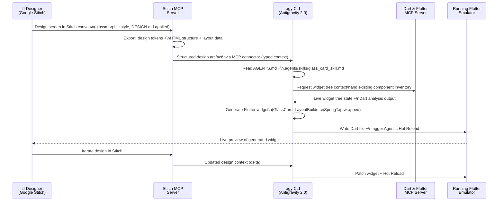

# TRD §2.5 — Vibe Coding Pipeline: Stitch → MCP → `agy`

> **Part of:** Module 2: Technical Requirement Document
> **Navigation:** Up from `03_multi_model_ai.md` | Next to `05_state_management.md`

---

Antigravity 2.0 replaces Gemini CLI with a faster Go-based CLI (`agy`), adds an SDK for custom agent workflows, and ships a Dart & Flutter MCP server that gives agents live context of your running app.

The three things that matter most for Flutter devs: `AGENTS.md`, Agentic Hot Reload, and the Stitch → MCP → Flutter pipeline.

---

## 2.5.1 — Full Pipeline Flow



### Step-by-Step Technical Workflow

**Step 1: Design in Google Stitch**

Stitch is evolving into an AI-native software design canvas that allows anyone to create, iterate, and collaborate on high-fidelity UI from natural language. You can easily extract a design system from any URL, or use the new `DESIGN.md` — an agent-friendly markdown file — to export or import your design rules to or from other design and coding tools.

For The Remainder Portal, prompt Stitch with:

```
"Design a mobile character profile screen for an aristocratic roleplay app.
Style: glassmorphism on warm ivory background, soft-gold borders, iridescent accents.
Components: circular avatar, character name in Cormorant Garamond serif, faction badge,
animated stat bars (strength/influence/mysticism), floating action button.
Primary surface: App (vertical scroll). Design system: apply DESIGN.md."
```

**Step 2: Connect via Stitch MCP**

Configure in `~/.antigravity/mcp_config.json`:

```json
{
  "mcpServers": {
    "stitch": {
      "command": "npx",
      "args": ["@_davideast/stitch-mcp", "proxy"]
    },
    "dart-flutter": {
      "command": "dart",
      "args": ["run", "dart_flutter_mcp_server"]
    }
  }
}
```

**Step 3: Generate Flutter Widgets with `agy`**

```bash
agy "Generate a Flutter CharacterProfileScreen widget from the Stitch design 
     context for screen 'character-profile'. Apply GlassCard component from 
     .agents/skills/glass_card_skill.md. Use Riverpod for state. 
     Make it responsive with LayoutBuilder breakpoints as per AGENTS.md."
```

**Step 4: Agentic Hot Reload**

If you are using Antigravity in Agent mode, the agent can automatically hot reload your running application when you prompt it to modify your app.

### Stitch Skills — Loop

Global skills — meaning those available to all workspaces when running `agy` CLI only — should go in `~/.gemini/antigravity-cli/skills`.

```bash
# Terminal 1: Run Flutter with MCP observer
flutter run --dart-define=ENV=dev

# Terminal 2: Run agy in Loop mode
agy --loop --skill=glass_card_skill --mcp=stitch,dart-flutter \
    "Watch for Stitch design updates on project 'remainder-portal' 
     and auto-generate corresponding Flutter widgets, applying 
     glass_card_skill.md rules on every update."
```

---

## 2.5.2 — AGENTS.md (Project Root)

This file is the agent's binding contract. It constrains `agy` generation to match architectural decisions.

```markdown
# AGENTS.md — The Remainder Portal

## Architecture Constraints
- ALL widgets must be built with Riverpod ConsumerWidget or ConsumerStatefulWidget
- NEVER use StatefulWidget with direct setState for business logic
- ALL async operations must use AsyncNotifierProvider
- Cross-platform breakpoints: mobile < 600dp | tablet 600–899dp | desktop 900dp+
- ALWAYS use LayoutBuilder, never MediaQuery.of(context).size directly

## Design System Rules
- ALL cards must use GlassCard from lib/ui/components/glass_card.dart
- GlassCard: Gaussian blur coefficients must be tuned within strict performance parameters: sigma_x, sigma_y in [6.0, 12.0]
- Touch animations MUST use SpringTapWrapper from lib/ui/animations/
- SpringTapWrapper: Must use an underdamped spring-mass-damper system with damping ratio (zeta) ≈ 0.85 (e.g., c=24 for k=200, m=1)
- Color palette: ONLY use constants from lib/theme/portal_theme.dart
- Typography: Headlines=Cormorant Garamond, Body=Jost, Stats=JetBrains Mono
- Shader Compilation: Iridescent accents must use custom fragment shaders via the FragmentProgram API running on device GPU. Verify real-time compilation without main-thread skips on native Impeller backend on test device.

## Sheets Service Rules
- NEVER call Google Sheets API directly from Flutter client
- ALL Sheets operations route through CloudRunSheetsProxy service
- Use optimistic updates with Riverpod invalidation on error
- ROSTER DATA MUST BE CACHED LOCALLY: Use HydratedStateNotifier or Isar
  to store the roster as an offline-first cache. App opens instantly from
  local cache; background fetches update silently. This prevents Google
  Sheets API rate-limit exhaustion (60 req/min) and ensures snappy,
  fluid spring animations even on slow connections.

## AI Router & RAG Rules  
- NEVER call AI APIs directly from Flutter client
- ALL AI calls route through CloudRunAIRouter
- DeepSeek-V4-Pro: grading tasks (grounded in Gemini 1.5 Pro context caching RAG pipeline)
- Groq Llama 4: real-time UI/tone evaluation tasks
- Gemini 1.5 Pro: narrative chronicle synthesis and 2M token context caching RAG

## Routing & Deep Links
- Use go_router for ALL navigation with typed routes
- Deep Links: Test native intent filters (/login-callback) early to verify alignment with Supabase transactional token hashes.

## Code Style
- Use freezed for ALL data models
- Write widget tests for ALL GlassCard component variations
```
