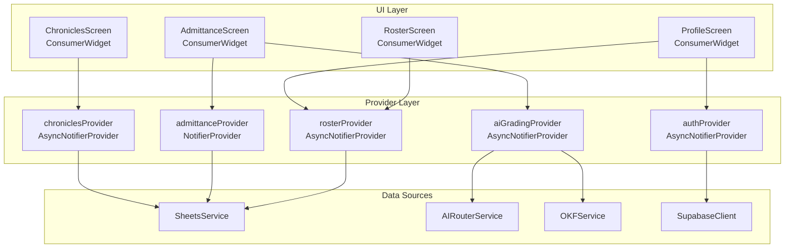

# TRD §2.6 — State Management Architecture (Riverpod)

> **Part of:** Module 2: Technical Requirement Document
> **Navigation:** Up from `04_vibe_coding_pipeline.md` | Next to `06_responsive_layout_and_auth.md`

---



### Provider Implementation Pattern

```dart
// lib/features/admittance/providers/admittance_provider.dart
@riverpod
class AdmittanceNotifier extends _$AdmittanceNotifier {
  @override
  Future<List<Application>> build() async {
    return ref.watch(sheetsServiceProvider).fetchPendingApplications();
  }

  Future<void> decideApplication({
    required String appId,
    required AdminDecision decision,
  }) async {
    // Optimistic update
    state = AsyncData(state.value!.where((a) => a.id != appId).toList());
    try {
      await ref.read(sheetsServiceProvider).writeAdmittanceDecision(
        appId: appId,
        decision: decision.name,
        deepseekScore: ref.read(aiGradingProvider(appId)).value?.deepseekScore ?? 0,
        groqFlags: ref.read(aiGradingProvider(appId)).value?.groqFlags ?? [],
      );
    } catch (e) {
      // Rollback on error
      ref.invalidateSelf();
      rethrow;
    }
  }
}
```
