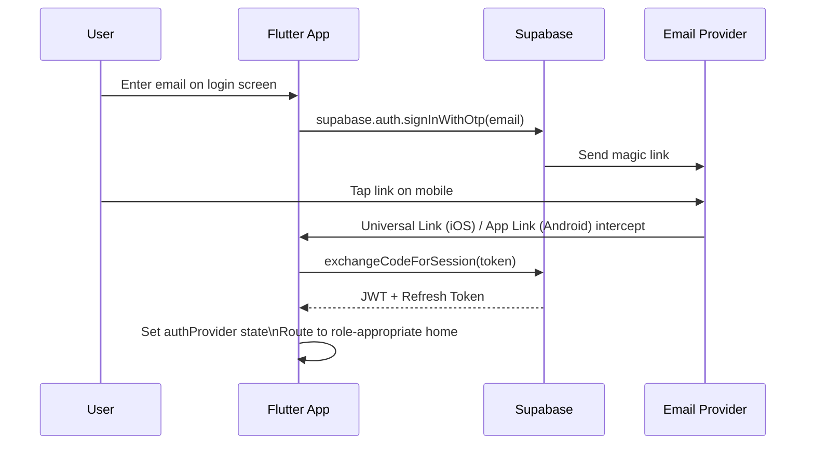

# TRD §2.7–2.8 — Responsive Layout & Authentication

> **Part of:** Module 2: Technical Requirement Document
> **Navigation:** Up from `05_state_management.md`

---

## 2.7 — Responsive Layout System

```dart
// lib/ui/layouts/responsive_layout.dart
class ResponsiveLayout extends StatelessWidget {
  final Widget mobile;
  final Widget? tablet;
  final Widget desktop;

  const ResponsiveLayout({
    super.key,
    required this.mobile,
    this.tablet,
    required this.desktop,
  });

  @override
  Widget build(BuildContext context) {
    return LayoutBuilder(
      builder: (context, constraints) {
        if (constraints.maxWidth >= 900) {
          return desktop;
        } else if (constraints.maxWidth >= 600) {
          return tablet ?? mobile;
        }
        return mobile;
      },
    );
  }
}

// Usage in RosterScreen:
ResponsiveLayout(
  mobile: RosterCardList(),       // Swipeable GlassCards
  tablet: RosterCardGrid(cols: 2), // 2-column grid
  desktop: RosterDataTable(),      // Full DataTable2
)
```

---

## 2.8 — Authentication & Deep Linking Security

### Passwordless Magic Link Flow



### iOS Universal Links Setup

`apple-app-site-association` (served at `https://remainder.app/.well-known/apple-app-site-association`):

```json
{
  "applinks": {
    "apps": [],
    "details": [{
      "appID": "TEAMID.com.remainder.portal",
      "paths": ["/login-callback", "/auth/callback", "/deep/*"]
    }]
  }
}
```

### Android App Links Setup

`assetlinks.json` (served at `https://remainder.app/.well-known/assetlinks.json`):

```json
[{
  "relation": ["delegate_permission/common.handle_all_urls"],
  "target": {
    "namespace": "android_app",
    "package_name": "com.remainder.portal",
    "sha256_cert_fingerprints": ["YOUR_SHA256_HERE"]
  }
}]
```

### Route Guard (go_router)

```dart
// lib/router/app_router.dart
final _adminRouteGuard = GoRouter(
  routes: [
    GoRoute(
      path: '/admin/admittance',
      redirect: (context, state) async {
        final auth = ref.read(authProvider);
        if (auth.value?.role != UserRole.admin) return '/403';
        return null; // Allow
      },
      builder: (_, __) => const AdmittanceScreen(),
    ),
  ],
);
```

### Deep Linking Architecture

Deep link resolution uses **Supabase Deep Linking paired with native Universal Links (iOS) and App Links (Android)**. The flow:

1. Supabase sends a magic link email with a custom URL scheme
2. On mobile, the OS intercepts the link via AASA/assetlinks verification
3. Flutter's go_router parses the deep link path and routes accordingly
4. The auth service exchanges the OTP for a session via Supabase's API
