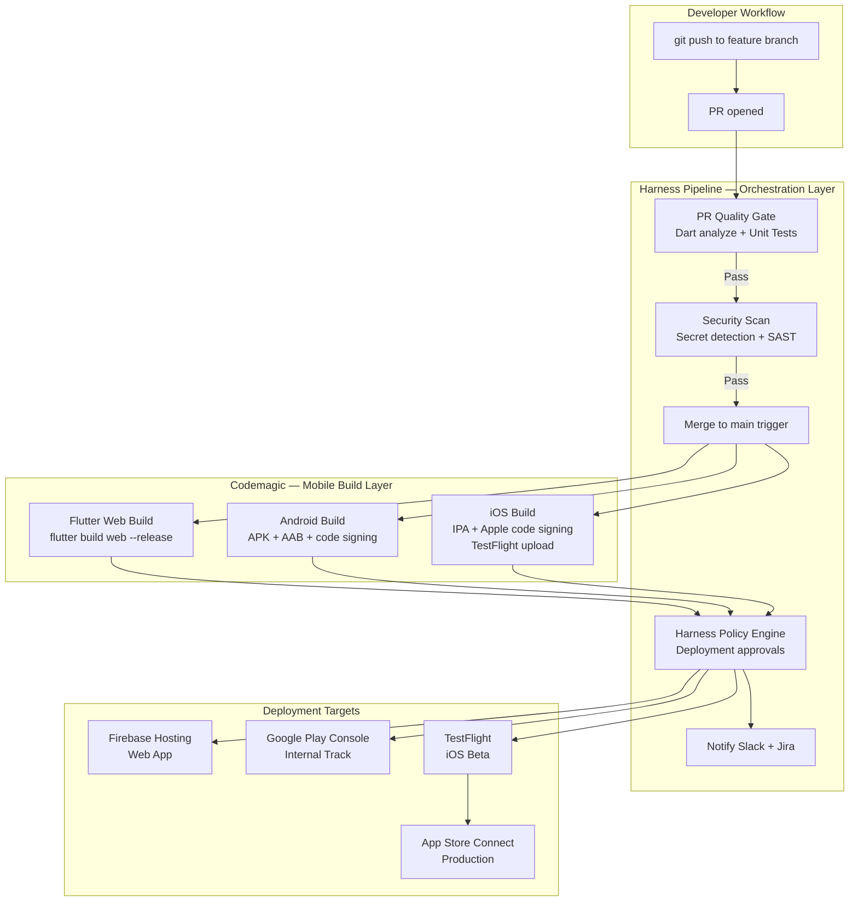
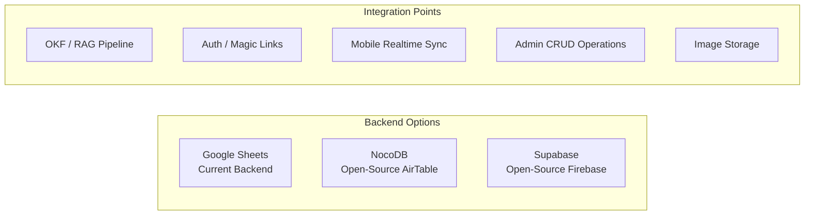
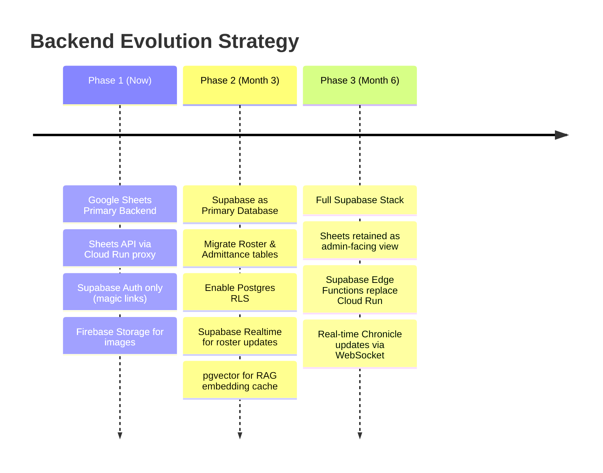

# Module 3: Next-Gen Tools — CI/CD & Backend Strategy

> **Part of:** Module 3: Next-Gen Tools
> **Navigation:** Up from `01_agentic_coding_agy.md` | Next to `03_notebooklm_rag_and_risk.md`

---

## 3.3 — CI/CD & Deployment: Harness + Codemagic Hybrid

### 3.3.1 — Platform Analysis

Harness is an enterprise-grade CI/CD platform with strong pipeline orchestration, policy enforcement, and secret management. However, it lacks native Flutter/mobile build agents. The architectural recommendation is a **Harness-orchestrated, Codemagic-executed** hybrid.

### 3.3.2 — Hybrid Pipeline Architecture



### Codemagic YAML for Flutter Multi-Platform

```yaml
# codemagic.yaml
workflows:
  remainder-portal-release:
    name: Remainder Portal — Full Release
    environment:
      flutter: 3.44.0
      xcode: latest
      vars:
        GOOGLE_PLAY_JSON: Encrypted(...)
        APP_STORE_CONNECT_KEY_ID: Encrypted(...)
        SHEETS_SERVICE_ACCOUNT: Encrypted(...)
    triggering:
      events: [push]
      branch_patterns: [{pattern: 'main'}]
    scripts:
      - name: Get dependencies
        script: flutter pub get
      - name: Run tests
        script: flutter test --coverage
      - name: Dart analyze
        script: dart analyze --fatal-infos
      - name: Build Web
        script: flutter build web --release --dart-define=ENV=production
      - name: Build Android AAB
        script: |
          flutter build appbundle --release \
            --dart-define=ENV=production \
            --obfuscate \
            --split-debug-info=build/debug-info/
      - name: Build iOS IPA
        script: |
          flutter build ipa --release \
            --dart-define=ENV=production \
            --obfuscate \
            --split-debug-info=build/debug-info/ \
            --export-options-plist=ios/ExportOptions.plist
    artifacts:
      - build/web/**
      - build/app/outputs/bundle/release/*.aab
      - build/ios/ipa/*.ipa
      - build/debug-info/
    publishing:
      google_play:
        credentials: $GOOGLE_PLAY_JSON
        track: internal
      app_store_connect:
        api_key: $APP_STORE_CONNECT_KEY_ID
        submit_to_testflight: true
```

### 3.3.3 — CI/CD Tool Comparison Matrix

| Criterion | Harness | Codemagic | GitHub Actions | Bitrise |
|---|---|---|---|---|
| **Flutter Native Support** | ❌ Requires custom | ✅ Native; pre-installed | 🟡 Via actions | ✅ Pre-built steps |
| **iOS Code Signing** | ❌ Manual setup | ✅ Built-in Apple Dev Portal | 🟡 Via fastlane | ✅ Built-in |
| **Enterprise Policy Engine** | ✅ Best-in-class | ❌ | 🟡 Via rulesets | ❌ |
| **Secret Management** | ✅ Enterprise grade | ✅ Encrypted vars | ✅ GitHub Secrets | ✅ |
| **Apple Silicon Runners** | ❌ | ✅ | 🟡 Paid | ✅ |
| **Web Deployment** | ✅ | ✅ Firebase integration | ✅ | 🟡 |
| **Cost (small team)** | 💰💰💰 Enterprise | 💰 500 free mins/mo | 💰 2000 free mins/mo | 💰 |
| **Recommended Role** | Orchestration + Policy | iOS/Android builds | PR gates | Alternative to Codemagic |

**Final Architecture Decision:** Harness handles orchestration, policy enforcement, and Slack/Jira notifications. Codemagic executes the actual Flutter builds for mobile platforms. GitHub Actions handles PR-level quality gates (analyze, test, format check) as the first line of defense.

---

## 3.4 — Alternative Backends Comparison

### 3.4.1 — Google Sheets vs. NocoDB vs. Supabase



### 3.4.2 — Detailed Comparison Matrix

| Criterion | Google Sheets | NocoDB | Supabase |
|---|---|---|---|
| **Mobile Data Sync** | 🟡 REST API; no realtime; polling required | 🟡 REST + Webhook; limited realtime | ✅ Postgres realtime via WebSockets; `supabase-flutter` package |
| **Auth / Magic Links** | ❌ No native auth | ❌ No native auth | ✅ Built-in OTP/magic link; deep link support |
| **Hosting Complexity** | ✅ Zero (Google-managed) | 🟡 Docker; self-hosted or NocoDB Cloud | 🟡 Supabase Cloud (easy) or self-hosted |
| **OKF/RAG Integration** | 🟡 Requires middleware | 🟡 Requires middleware | ✅ Postgres + pgvector for embedding storage |
| **Structured Queries** | ❌ Spreadsheet logic only | ✅ SQL-like via NocoDB API | ✅ Full PostgreSQL |
| **Image/File Storage** | ❌ External required | 🟡 Attachments field | ✅ Built-in S3-compatible storage |
| **Row-Level Security** | ❌ None (spreadsheet) | 🟡 Role-based via NocoDB | ✅ PostgreSQL RLS policies |
| **Cost (15 members)** | ✅ Free | ✅ Free self-hosted | ✅ Free tier (500MB DB, 1GB storage) |
| **Familiarity Curve** | ✅ Team already uses it | 🟡 Low — spreadsheet-like UI | 🟡 Medium — SQL knowledge helpful |
| **Flutter SDK** | ❌ googleapis package | ❌ REST only | ✅ Official `supabase_flutter` package |
| **Recommended** | Phase 1 (existing) | ❌ Not recommended | ✅ Phase 2 migration target |

### 3.4.3 — Recommended Migration Path



### Migration Rationale

**Why Keep Sheets in Phase 1:** The existing admin team is deeply familiar with Google Sheets. The community has operational data already there. The Cloud Run proxy pattern insulates the Flutter client from the backend so migration is transparent to the app.

**Why Migrate to Supabase in Phase 2:**
- Realtime roster sync eliminates polling
- Row-level security enforces admin vs. player data boundaries at the database level
- pgvector enables on-platform RAG embedding caching, reducing NotebookLM API calls
- Official `supabase_flutter` package reduces boilerplate significantly vs. raw Sheets API calls
- Magic link auth becomes first-class with deep link handling
