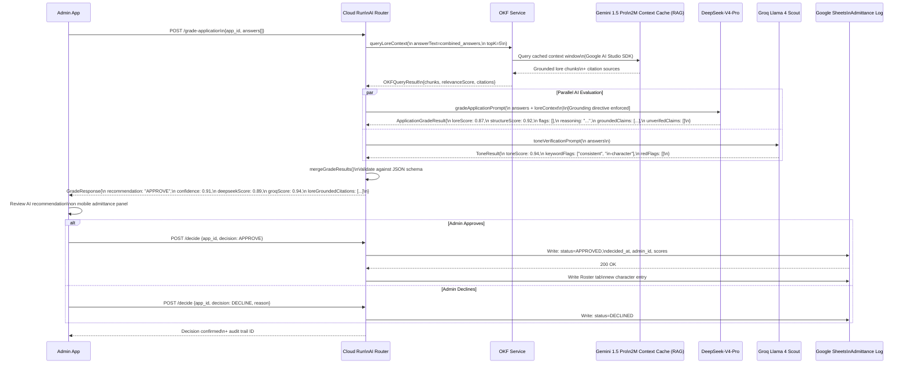

# Module 3: Next-Gen Tools — RAG Loop, Tools Matrix & Risk Register

> **Part of:** Module 3: Next-Gen Tools
> **Navigation:** Up from `02_cicd_deployment.md`

---

## 3.5 — Gemini 1.5 Pro / NotebookLM RAG Evaluation Loop

---

## 3.6 — Final Tools Summary Matrix

| Tool | Role in Stack | Tier | Replaceability |
|---|---|---|---|
| **Flutter 3.44** | Cross-platform UI framework | 🔴 Critical | Low |
| **Riverpod 3.x** | State management | 🔴 Critical | Medium |
| **Google Stitch** | UI design canvas → Vibe Coding | 🟡 High | Medium (Figma alt.) |
| **Antigravity CLI (`agy`)** | Code generation agent | 🟡 High | Medium (Claude Code alt.) |
| **Antigravity IDE** | Development environment | 🟡 High | Medium (VS Code + ext.) |
| **Dart & Flutter MCP Server** | Agent ↔ codebase bridge | 🟡 High | Low (ecosystem-specific) |
| **DeepSeek-V4-Pro** | Deep lore grading & reasoning | 🟡 High | Medium (Gemini alt.) |
| **Groq Llama 4 Scout** | Fast real-time evaluation | 🟡 High | Medium (GPT-4o-mini alt.) |
| **Gemini 1.5 Pro** | RAG Context Cache + Chronicle synthesis | 🔴 Critical | Low |
| **Genkit Dart** | AI flow orchestration | 🟡 High | Medium |
| **Google Sheets** | Phase 1 data backend | 🟡 Phase 1 only | High (→ Supabase) |
| **Supabase** | Phase 2 primary backend + auth | 🔴 Critical (Phase 2) | Medium |
| **Harness** | CI/CD orchestration + policy | 🟡 High | High (GitHub Actions) |
| **Codemagic** | Flutter mobile build execution | 🟡 High | Medium (Bitrise) |
| **go_router** | Navigation + route guards | 🔴 Critical | Low |
| **freezed** | Data model codegen | 🟡 High | Medium |

---

## 3.7 — Risk Register

| Risk | Probability | Impact | Mitigation |
|---|---|---|---|
| `agy` generates non-responsive widgets | Medium | High | `AGENTS.md` constraints + CI widget tests |
| DeepSeek-V4-Pro hallucinates lore | Medium | Critical | OKF grounding directive + unverified claim flagging |
| Google Sheets API rate limits (60 req/min) | Low | High | Cloud Run caching layer + batch reads; offline-first local cache via HydratedStateNotifier/Isar |
| NotebookLM Enterprise API querying limitations | High | Critical | **Workaround**: Background conversion to Markdown + programmatic Gemini 1.5 Pro 2M token context caching |
| iOS Universal Links / Android App Links deep link interception failure | Medium | High | Test intent filters `/login-callback` early against Supabase hashes; verify static AASA/assetlinks files |
| UI/GPU bottlenecks due to high backdrop Gaussian blur | Medium | Medium | Strict rendering bounds constraint: $\sigma_x, \sigma_y \in [6.0, 12.0]$ in `GlassCard` |
| Micro-interaction feel mismatch | Low | Low | Underdamped Spring Fluidity tuned to damping ratio $\zeta \approx 0.85$ ($c \approx 24$) |
| Shader compilation skips during run-time on emulator/device | Medium | Medium | Ensure test device / emulator is running Impeller backend natively to compile fragment shaders on GPU |
| Admin route exposed client-side | Low | Critical | go_router redirect + server-side token validation on every admin API call |
